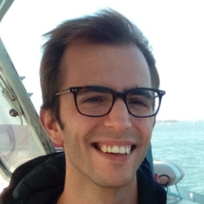

## About Me
I am a **Postdoctoral Researcher in AI & Physics**, focusing on:
- Computational neuroscience 🧠
- MRI & Cancer Imaging 🏥
- Irreversibility in Time Series 📈

📍 Based in Italy  
📧 [Email Me](mailto:your-email@example.com)  

---

## 📂 Publications
- **Paper 1**: [Title Here](#)
- **Paper 2**: [Title Here](#)

---

## 🎤 Talks & Teaching
- **Talk 1**: [Conference Name](#)
- **Course 1**: [Teaching Page](#)

---

## 🔗 Links
[GitHub](https://github.com/mvodret) | [Google Scholar](#) | [Twitter](#)
